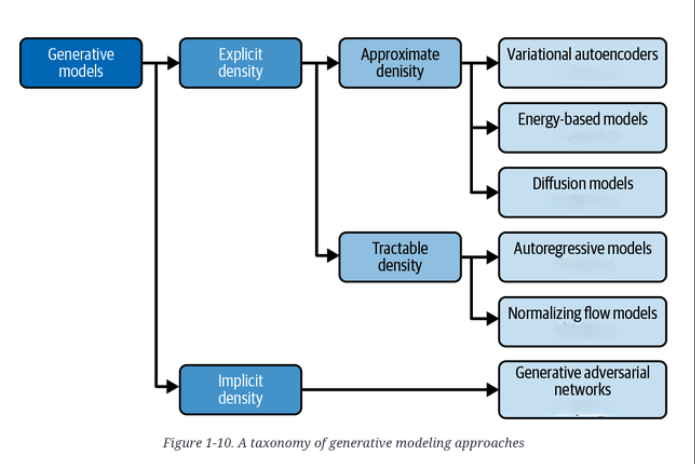

### Introduction 
---
This section will contain my notes of the course [XCS236](https://online.stanford.edu/courses/xcs236-deep-generative-models) - Deep Generative Models. I would be including some information I got from reading the [text book from OReilly](https://learning.oreilly.com/library/view/generative-deep-learning/9781098134174) as well. That book is on the same subject. So here I go ...

### What is Generative Modelling 
---
 
Generative modeling is a branch of machine learning that involves training a model to produce new data that is similar to a given dataset.

### Example Use Cases 
---

##### Image Generation & Control
Generative models can create realistic images based on rough sketches or other control signals.
These models help users who may not be skilled artists to generate high-quality visual content.

##### Audio Applications
Similar techniques apply to generative models for audio, where input signals can shape the generated sound.
Examples include voice synthesis and music composition.

##### Enhancements & Applications
Generative models are used in tasks like style transfer, content creation, and data augmentation.
They enable creative control, allowing for transformation of inputs into complex, high-quality outputs.

### Generative Versus Discriminative Modeling
---
Discriminative modeling estimates *p(y|x)* i.e. discriminative modeling aims to model the probability of a label given some observation. Generative modeling estimates *p(x)* i.e.generative modeling aims to model the probability of observing an observation. Sampling from this distribution allows us to generate new observations.

### Modelling High Level View - What do we do in the modelling process?
---
- We have a dataset of observations 
- We assume that the observations have been generated according to some unknown distribution, *pdata*
- We want to build a generative model *ptheta*
 that mimics *pdata*
- If we achieve this goal, we can sample from 
 to generate observations that appear to have been drawn from *pdata*

### What all we can do once we have learn a generative model 
---
1. Generation: It should be possible to easily sample a new observation from *ptheta* and the generated sample should look as if it was generated from *pdata* (sampling)
2. Density estimation: *ptheta(x)* should be high if x looks like being generated from *pdata*, and low otherwise (anomaly detection)
3. Unsupervised representation learning: We should be able to learn the latent features of the data. In case of images it means what the images have in common. For e.g. in case of images of animals, features can be ears, tail, etc. (features)

### Intuitive explanation of what is Representation Learning
---
Suppose you wanted to describe your appearance to someone who was looking for you in a crowd of people and didn’t know what you looked like. You wouldn’t start by stating the color of pixel 1 of a photo of you, then pixel 2, then pixel 3, etc. Instead, you would make the reasonable assumption that the other person has a general idea of what an average human looks like, then amend this baseline with features that describe groups of pixels, such as I have very blond hair or I wear glasses. With no more than 10 or so of these statements, the person would be able to map the description back into pixels to generate an image of you in their head. The image wouldn’t be perfect, but it would be a close enough likeness to your actual appearance for them to find you among possibly hundreds of other people, even if they’ve never seen you before.

This is the core idea behind representation learning. Instead of trying to model the high-dimensional sample space directly, we describe each observation in the training set using some lower-dimensional latent space and then learn a mapping function that can take a point in the latent space and map it to a point in the original domain. In other words, each point in the latent space is a representation of some high-dimensional observation.

### Perspective on different generative models 
---
While all types of generative models ultimately aim to solve the same task, they all take slightly different approaches to modeling the density function. Broadly speaking, there are three possible approaches:

1. Explicitly model the density function, but constrain the model in some way, so that the density function is tractable (i.e., it can be calculated).
2. Explicitly model a tractable approximation of the density function.
3. Implicitly model the density function, through a stochastic process that directly generates data.

 

### Details about some of the prominent models
---
I have created a separate page for each kind of models. I'll be covering the following aspects for each of them:
- Basic Intuition/Theory about them
- What are there pros and cons
- How they are trained and whether a latent representation is learnt
- How sampling works for them
- How to compute the probability of a new sample
- Sample Code Link (if available)

##### List of models
- [Autoregressive Models](./models/AutoRegressiveModels.md)
- [Variational Auto Encoders](./models/VAEs.md)
- [Normalizing Flow Models](./models/NormalizingFlowModels.md)
- [GANs](./models/GANs.md)
- [Energy Based Models](./models/EnergyBasedModels.md)
- [Score Based Models](./models/ScoreBasedModels.md)

### Evaluation of Generative Models 
---
[TBD]

### Useful Links 
---
- [Course] [XCS236](https://online.stanford.edu/courses/xcs236-deep-generative-models)
- [Course Notes] [Course Notes from Dr. Stefano](https://deepgenerativemodels.github.io/notes/index.html)
- [Tutorial] [Diffusion and Score Based Models Tutorial by Dr. Yang Song](https://www.youtube.com/watch?v=wMmqCMwuM2Q)
- [Book] [Generative Deep Learning](https://learning.oreilly.com/library/view/generative-deep-learning/9781098134174)
- [Book] [Build a Large Language Model (From Scratch)](https://learning.oreilly.com/library/view/build-a-large/9781633437166/)
- [Blog][SSVAE](https://gmanco.github.io/post/on-semisupervised-vae/)
- [Video][Diffusion Models - Yang Song](https://www.youtube.com/watch?v=wMmqCMwuM2Q)
- [Video][Diffusion Models - DDPM](https://www.youtube.com/watch?v=H45lF4sUgiE)
- [Video][Diffusion Models - DDIM](https://www.youtube.com/watch?v=n2P6EMbN0pc)

### Students Questions 
---
[Student Questions that were discussed during XCS236 Jan-Apr 2025](./faqs/StudentQuestions.md)

